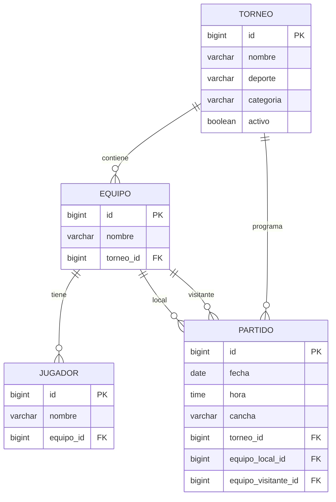

# Arquitectura — Sprint 2

## Objetivo
Persistir torneos, equipos, jugadores y partidos en PostgreSQL y exponer una API REST para consulta y registro.

## Capas

- `model`: entidades JPA.
- `repository`: acceso a datos mediante Spring Data JPA.
- `service`: reglas de negocio y transacciones.
- `controller`: API REST.
- `dto`: contratos de entrada/salida de la API.
- `view`: interfaz Vaadin.
- `resources/db/migration`: versionamiento del esquema mediante Flyway.

## Relaciones

## Flujo de registro de equipo

`RegistrarEquipoView -> EquipoService -> EquipoRepository -> Hibernate/JPA -> PostgreSQL`

Los jugadores se crean como hijos del equipo y se persisten mediante `CascadeType.ALL`.

## Flujo de fixture

`ProgramarPartidoView -> PartidoService -> PartidoRepository -> PostgreSQL`

Antes de guardar, el servicio verifica que los dos equipos pertenezcan al torneo seleccionado y que sean diferentes.

## REST

- `POST /api/torneos`
- `GET /api/torneos`
- `POST /api/torneos/{torneoId}/equipos`
- `GET /api/torneos/{torneoId}/equipos`
- `POST /api/torneos/{torneoId}/partidos`
- `GET /api/torneos/{torneoId}/partidos`
